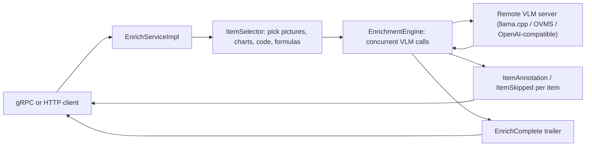

# grpc-enrich

gRPC enrichment service: VLM picture-describe, chart extract, and formula/code
annotations on a gRParse Document.

Java gRPC server. A `Document` in, a live stream of typed `ItemAnnotation` /
`ItemSkipped` events out, keyed by `self_ref`. The VLM is a remote server
(llama.cpp, OVMS, or any OpenAI-compatible HTTP endpoint) that this process
calls; no model weights, no torch, no transformers in this binary. Diskless:
documents live only in memory for the duration of the RPC.



## Build and test

Requires JDK 25 and (for proto lint) buf.

```sh
./gradlew build        # compiles, generates stubs from proto/, runs tests
buf lint               # STANDARD + COMMENTS, vendored document.proto exempt from COMMENTS
./gradlew :enrich-service:installDist
```

Tests run against an in-process fake VLM HTTP endpoint (no network, no
weights), including proof that events stream before the client half-closes
and that per-item events are never held back into a batch.

## Run

```sh
ENRICH_VLM_URL=http://localhost:8080 \
  enrich-service/build/install/enrich-service/bin/enrich-service
```

| Env | Default | Meaning |
|---|---|---|
| `ENRICH_PORT` | `50056` | gRPC listen port |
| `ENRICH_HTTP_PORT` | `50068` | HTTP front-end listen port; `0` or empty disables the HTTP listener |
| `ENRICH_VLM_URL` | unset | Default VLM endpoint (base URL; the client posts to `<url>/v1/chat/completions`). Per-request `EnrichOptions.vlm_endpoint` overrides |
| `ENRICH_MAX_DOCUMENT_MIB` | `70` | Assembled document byte cap (`RESOURCE_EXHAUSTED` above) |
| `ENRICH_MAX_CONCURRENT_VLM` | cores (min 2) | Cap on concurrent VLM calls per request |
| `ENRICH_VLM_TIMEOUT_SECONDS` | `300` | Per-VLM-call timeout |
| `ENRICH_METRICS_INTERVAL_SECONDS` | `60` | Metrics line interval; 0 disables |

The server registers `grpc.health.v1.Health` and server reflection (v1 and
v1alpha).

## Wire API

`ai.pipestream.enrich.v1.EnrichService` (see
[`proto/ai/pipestream/enrich/v1/enrich_service.proto`](proto/ai/pipestream/enrich/v1/enrich_service.proto)):

- `EnrichDocument(stream EnrichDocumentRequest) returns (stream EnrichDocumentResponse)`:
  the first message carries `EnrichOptions` (one boolean per job:
  `do_picture_description`, `do_chart_extraction`, `do_code_enrichment`,
  `do_formula_enrichment`, enum presets with `*_raw` fallbacks, endpoint /
  concurrency / timeout overrides) plus the document inline or as
  `DocumentChunk` slices; `ItemImage` messages carry stripped crops.
  Events: `EnrichStarted` (counts selected), one `ItemAnnotation` or
  `ItemSkipped` per item as that VLM call returns, `EnrichComplete` trailer.
  Chart extraction lands as typed `TableData` cells, never CSV-only. A failed
  VLM call is an `ItemSkipped` (`SKIP_REASON_VLM_ERROR`), never an RPC error.
- `GetServiceInfo`: versions, default endpoint, byte cap, concurrency cap, and
  the `UiInfo` frontend advertisement (tab title/path/tooltip) shared with the
  other ai-pipestream services.

`ai/pipestream/document/v1/document.proto` is vendored verbatim from gRParse
(the canonical copy); do not edit it here.

## HTTP API

The same binary also serves an HTTP front end on `ENRICH_HTTP_PORT` (default
`50068`; set to `0` or empty to disable). It is a thin shim over the gRPC
`EnrichServiceImpl`: requests are driven through the same streaming code
path, so events, skip semantics, and the byte cap are identical. All bodies
are canonical proto3 JSON (protobuf `JsonFormat`): camelCase or snake_case
keys, enum names, base64 bytes. `GetServiceInfo` stays gRPC-only.

Request body for both enrich endpoints:

```json
{
  "options": {"doPictureDescription": true, "document": {"name": "doc", "...": "..."}},
  "item_images": [{"selfRef": "#/texts/0", "data": "...base64...", "mimetype": "image/png"}]
}
```

`options` is an `EnrichOptions` message (the document may ride inline in
`options.document`, as here) and `document` is an optional top-level
`Document` message (mutually exclusive with `options.document`; it goes the
chunked route, so `item_images` crops apply and the byte cap is enforced).

- `POST /v1/enrich`: collects the whole stream and returns it at once:
  `{"events": [<EnrichDocumentResponse as proto3 JSON>, ...]}` in stream
  order (started, per-item annotation/skipped, complete trailer).
  `200` on success, `400` on `INVALID_ARGUMENT` (malformed JSON, no
  document), `413` on `RESOURCE_EXHAUSTED` (byte cap), `500` otherwise.
- `POST /v1/enrich/stream`: the same request, answered as chunked NDJSON
  (`application/x-ndjson`): each `EnrichDocumentResponse` is written as one
  flushed line the moment the stream produces it, so HTTP callers see the
  same live per-item events gRPC clients get. A mid-stream failure ends the
  response with a final `{"error": "..."}` line.
- `GET /healthz`: `200 ok` when the server is up.

```sh
# Sync: one JSON document with every event
curl -s localhost:50068/v1/enrich -d '{
  "options": {"doPictureDescription": true, "document": {"name": "doc", "pictures": ["..."]}}
}'

# Async: live per-item events as NDJSON
curl -sN localhost:50068/v1/enrich/stream -d '{
  "options": {"doPictureDescription": true, "document": {"name": "doc", "pictures": ["..."]}}
}'
# {"started":{"pictureDescriptions":2}}
# {"annotation":{"selfRef":"#/pictures/0","description":{"text":"a QR code"}, "...": "..."}}
# {"annotation":{"selfRef":"#/pictures/1","description":{"text":"..."}, "...": "..."}}
# {"complete":{"succeeded":2}}
```

## Enrichment semantics

Item selection. A picture is described when its area is at least
`picture_description_area_threshold` of its page's area; unset (0) or NaN
applies the default 0.05, and a negative value disables the threshold.
Pictures without provenance or a known page size are treated as full-page and
always pass. Chart extraction runs when the picture's top figure-class
prediction is one of the supported chart types (`bar_chart`, `pie_chart`,
`line_chart`) or the picture carries the label `DOC_ITEM_LABEL_CHART`. Code
and formula items are selected by their existing item labels; this service
does not re-run layout.

Prompts are fixed per job. Picture description: `Describe this image in a few
sentences.` (SmolVLM preset) or `What is shown in this image?` (Granite
Vision preset). Chart: `Convert the information in this chart into a data
table in CSV format.` Code and formula with an image crop: the bare `<code>`
/ `<formula>`.

Code and formula items are sent as image crops when an `ItemImage` is
supplied for the item's `self_ref` (code items may also carry an inline
data-URI `ImageRef`); without a crop, a text-only prompt with the existing
item text is the fallback. Output is post-processed: truncate at
`<end_of_utterance>`, strip `</code>` / `</formula>` / the `<loc_0>...`
sentinel, lstrip, and parse the leading `<_language_>` token into
`CodeAnnotation.language` (exact-case match against the document schema's
`CodeLanguageLabel` value strings, UNKNOWN fallback) and `language_raw`.
`return_document` also sets `code_language` / `code_language_raw` on the
patched `CodeItem`.

Chart CSV becomes typed `TableData`: the first row is a column-header row
only when all its values are non-numeric; any non-numeric data cell is marked
`row_header=true` (an empty cell counts as non-numeric).

Generation budgets (`max_tokens`): description 200, code/formula 2048, chart
4096 (a wide table does not fit in 2048).

Transient VLM failures (HTTP 429/500/502/503/504 and connection drops) are
retried up to 5 times with exponential backoff starting at 0.1s, then the
item is skipped with `SKIP_REASON_VLM_ERROR` rather than failing the RPC.
Every skip carries an explicit reason, and description annotations record the
model name as provenance.

## Start here (humans and LLMs)

1. [`AGENTS.md`](AGENTS.md): read order, definition of done, git
2. [`docs/architecture.md`](docs/architecture.md): where this sits, language, live stream design
3. [`docs/design.md`](docs/design.md): wire API, Document mapping, tests
4. [`docs/guidelines.md`](docs/guidelines.md): how to build it so it matches the fleet

Operational patterns are copied from the grPOIc / grpc-email Java siblings
(two-module Gradle layout, virtual threads, byte cap, in-process test fakes)
and the gRParse Document proto.

## Docs

- [Architecture](docs/architecture.md): where this sits in the collector fleet
- [Design](docs/design.md): wire API, Document mapping, tests
- [Guidelines](docs/guidelines.md): how to build it so it matches the fleet

## Remotes

- **Forgejo** (`git.rokkon.com/ai-pipestream/grpc-enrich`) is the source of truth. `main` lives here.
- **GitHub** is a public push-mirror of `main`. Do not merge to GitHub `main`.
- GitHub's default branch is `development` so LLM / `gh` work lands there instead of clobbering the mirror.

Push Forgejo first. GitHub `main` updates from the Forgejo push-mirror.
