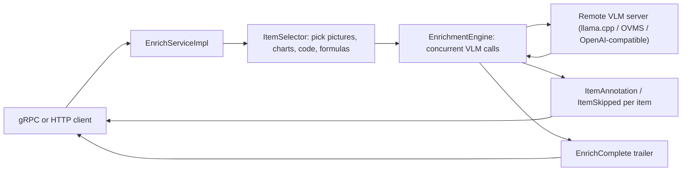

# grpc-enrich

gRPC enrichment service: VLM picture-describe, chart extract, and formula/code
annotations on a gRParse Document.

Java gRPC server. A `Document` in, a live stream of typed `ItemAnnotation` /
`ItemSkipped` events out, keyed by `self_ref`. The VLM is a remote server
(llama.cpp, OVMS, or any OpenAI-compatible HTTP endpoint) that this process
calls; no model weights, no torch, no transformers in this binary. Diskless:
documents live only in memory for the duration of the RPC.


```mermaid
flowchart LR
    client["gRPC or HTTP client"] --> svc["EnrichServiceImpl"]
    svc --> sel["ItemSelector: pick pictures, charts, code, formulas"]
    sel --> eng["EnrichmentEngine: concurrent VLM calls"]
    eng --> vlm["Remote VLM server (llama.cpp / OVMS / OpenAI-compatible)"]
    vlm --> eng
    eng --> events["ItemAnnotation / ItemSkipped per item"]
    events --> client
    eng --> trailer["EnrichComplete trailer"]
    trailer --> client
```

## Build and test

Requires JDK 25 and (for proto lint) buf.

```sh
./gradlew build        # compiles, generates stubs from proto/, runs tests
buf lint               # STANDARD + COMMENTS, vendored document.proto exempt from COMMENTS
./gradlew :enrich-service:installDist
```

Tests run against an in-process fake VLM HTTP endpoint (no network, no
weights), including proof that events stream before the client half-closes
and that per-item events are never held back into a batch.

## Run

```sh
ENRICH_VLM_URL=http://localhost:8080 \
  enrich-service/build/install/enrich-service/bin/enrich-service
```

| Env | Default | Meaning |
|---|---|---|
| `ENRICH_PORT` | `50056` | gRPC listen port |
| `ENRICH_HTTP_PORT` | `50068` | HTTP front-end listen port; `0` or empty disables the HTTP listener |
| `ENRICH_VLM_URL` | unset | Default VLM endpoint: a base URL (`http://vlm:8080`; the client posts to `<url>/v1/chat/completions`) or a full endpoint URL (see [VLM endpoint URLs](#vlm-endpoint-urls)). Logs and `GetServiceInfo` show only its origin |
| `ENRICH_VLM_API_KEY` | unset | Bearer token sent as `Authorization` to `ENRICH_VLM_URL` only, never to a per-request endpoint. Use it instead of a credential in the URL |
| `ENRICH_ALLOW_REQUEST_ENDPOINT` | `false` | `true` lets a request name any http(s) VLM endpoint (`EnrichOptions.vlm_endpoint`, `chart_extraction.vlm_endpoint`); otherwise such a request is `PERMISSION_DENIED`. See [Security](#security) |
| `ENRICH_VLM_ENDPOINT_ALLOWLIST` | unset | Comma-separated origins (`https://vlm.internal:8443`) a request may name even when `ENRICH_ALLOW_REQUEST_ENDPOINT` is off |
| `ENRICH_MAX_DOCUMENT_MIB` | `70` | Byte cap on a document (inline or chunked) plus its `ItemImage` crops (`RESOURCE_EXHAUSTED` above); also sizes the HTTP body limit |
| `ENRICH_MAX_CONCURRENT_VLM` | cores (min 2) | Cap on concurrent VLM calls per request |
| `ENRICH_VLM_TIMEOUT_SECONDS` | `300` | Per-VLM-call timeout (the reply body included), and the ceiling on `EnrichOptions.timeout_seconds` |
| `ENRICH_METRICS_INTERVAL_SECONDS` | `60` | Metrics line interval; 0 disables |

The server registers `grpc.health.v1.Health` and server reflection (v1 and
v1alpha).

## Wire API

`ai.pipestream.enrich.v1.EnrichService` (see
[`proto/ai/pipestream/enrich/v1/enrich_service.proto`](proto/ai/pipestream/enrich/v1/enrich_service.proto)):

- `EnrichDocument(stream EnrichDocumentRequest) returns (stream EnrichDocumentResponse)`:
  the first message carries `EnrichOptions` (one boolean per job:
  `do_picture_description`, `do_chart_extraction`, `do_code_enrichment`,
  `do_formula_enrichment`, enum presets with `*_raw` fallbacks, endpoint /
  concurrency / timeout overrides) plus the document inline or as
  `DocumentChunk` slices; `ItemImage` messages carry stripped crops, sent
  before the chunk marked complete (at most 100000, inside the byte cap).
  Events: `EnrichStarted` (counts selected), one `ItemAnnotation` or
  `ItemSkipped` per item as that VLM call returns, `EnrichComplete` trailer.
  Chart extraction lands as typed `TableData` cells, never CSV-only. A failed
  VLM call is an `ItemSkipped` (`SKIP_REASON_VLM_ERROR`), never an RPC error.
- `GetServiceInfo`: versions, the default endpoint's origin, byte cap,
  concurrency cap, and the `UiInfo` frontend advertisement (tab title/path/
  tooltip) shared with the other ai-pipestream services.

`ai/pipestream/document/v1/document.proto` is vendored verbatim from gRParse
(the canonical copy); do not edit it here.

## HTTP API

The same binary also serves an HTTP front end on `ENRICH_HTTP_PORT` (default
`50068`; set to `0` or empty to disable). It is a thin shim over the gRPC
`EnrichServiceImpl`: requests are driven through the same streaming code
path, so events, skip semantics, and the byte cap are identical. All bodies
are canonical proto3 JSON (protobuf `JsonFormat`): camelCase or snake_case
keys, enum names, base64 bytes. `GetServiceInfo` stays gRPC-only.

Request body for both enrich endpoints:

```json
{
  "options": {"doPictureDescription": true, "document": {"name": "doc", "...": "..."}},
  "item_images": [{"selfRef": "#/texts/0", "data": "...base64...", "mimetype": "image/png"}]
}
```

`options` is an `EnrichOptions` message (the document may ride inline in
`options.document`, as here) and `document` is an optional top-level
`Document` message (mutually exclusive with `options.document`; it goes the
chunked route, so `item_images` crops apply). The byte cap applies either
way. A body over 4/3 of the byte cap plus 1 MiB is answered 413 before it is
parsed (from `Content-Length` when present, without reading the body).

- `POST /v1/enrich`: collects the whole stream and returns it at once:
  `{"events": [<EnrichDocumentResponse as proto3 JSON>, ...]}` in stream
  order (started, per-item annotation/skipped, complete trailer).
  `200` on success, `400` on `INVALID_ARGUMENT` (malformed JSON, no
  document), `403` on `PERMISSION_DENIED` (a per-request endpoint the
  operator has not allowed), `413` on `RESOURCE_EXHAUSTED` (byte cap, body
  limit), `500` otherwise.
- `POST /v1/enrich/stream`: the same request, answered as chunked NDJSON
  (`application/x-ndjson`): each `EnrichDocumentResponse` is written as one
  flushed line the moment the stream produces it, so HTTP callers see the
  same live per-item events gRPC clients get. A mid-stream failure ends the
  response with a final `{"error": "..."}` line. When the client hangs up,
  the next event write fails and the call is cancelled, so its VLM calls
  stop.
- `GET /healthz`: `200 ok` when the server is up.

```sh
# Sync: one JSON document with every event
curl -s localhost:50068/v1/enrich -d '{
  "options": {"doPictureDescription": true, "document": {"name": "doc", "pictures": ["..."]}}
}'

# Async: live per-item events as NDJSON
curl -sN localhost:50068/v1/enrich/stream -d '{
  "options": {"doPictureDescription": true, "document": {"name": "doc", "pictures": ["..."]}}
}'
# {"started":{"pictureDescriptions":2}}
# {"annotation":{"selfRef":"#/pictures/0","description":{"text":"a QR code"}, "...": "..."}}
# {"annotation":{"selfRef":"#/pictures/1","description":{"text":"..."}, "...": "..."}}
# {"complete":{"succeeded":2}}
```

## Enrichment semantics

Item selection. A picture is described when its area is at least
`picture_description_area_threshold` of its page's area; unset (0) or NaN
applies the default 0.05, and a negative value disables the threshold.
Pictures without provenance or a known page size are treated as full-page and
always pass. Chart extraction runs when the picture's top figure-class
prediction is one of the supported chart types (`bar_chart`, `pie_chart`,
`line_chart`) or the picture carries the label `DOC_ITEM_LABEL_CHART`. Code
and formula items are selected by their existing item labels; this service
does not re-run layout.

Prompts are fixed per job. Picture description: `Describe this image in a few
sentences.` (SmolVLM preset) or `What is shown in this image?` (Granite
Vision preset). Chart, without `EnrichOptions.chart_extraction`: one call
per chart, `Convert the information in this chart into a data table in CSV
format.` Code and formula with an image crop: the bare `<code>` /
`<formula>`.

Chart outputs (`EnrichOptions.chart_extraction`, the Docling chart stage).
Three independent outputs, each its own VLM call per chart and its own event:
`csv` (default on) becomes a `ChartTable`, `summary` a `ChartSummary`, `code`
a `ChartCode` (Python). The prompts are the Granite Vision special tokens
`<chart2csv>`, `<chart2summary>`, `<chart2code>`, or with
`natural_language_prompts` Docling's natural-language equivalents, verbatim.
Post-processing follows Docling: the CSV is the body of the first fenced
`csv` block when there is one (otherwise the reply with stray fences
stripped); the summary is the reply verbatim; the code is the body of the
first fenced `python` block. A reply that yields nothing usable (a blank
summary, no python fence, unparseable CSV) skips that output only, as an
`ItemSkipped` whose `chart_output` names it; the chart's other outputs still
land. `chart_extraction.model` and `chart_extraction.vlm_endpoint` route the
chart calls to their own model and endpoint without touching the other jobs.
All three outputs switched off is `INVALID_ARGUMENT`. With `return_document`,
the summary lands in the picture's `meta.description` and the code in
`meta.code`, both with `created_by` naming the model.

Code and formula items are sent as image crops when an `ItemImage` is
supplied for the item's `self_ref` (code items may also carry an inline
data-URI `ImageRef`); without a crop, a text-only prompt with the existing
item text is the fallback. Output is post-processed: truncate at
`<end_of_utterance>`, strip `</code>` / `</formula>` / the `<loc_0>...`
sentinel, lstrip, and parse the leading `<_language_>` token into
`CodeAnnotation.language` (exact-case match against the document schema's
`CodeLanguageLabel` value strings, UNKNOWN fallback) and `language_raw`.
`return_document` also sets `code_language` / `code_language_raw` on the
patched `CodeItem`.

Chart CSV becomes typed `TableData`: the first row is a column-header row
only when all its values are non-numeric; any non-numeric data cell is marked
`row_header=true` (an empty cell counts as non-numeric).

Generation budgets (`max_tokens`): description 200, code/formula 2048, chart
4096 for every chart output (a wide table does not fit in 2048).

Transient VLM failures (HTTP 429/500/502/503/504 and connection drops) are
retried up to 5 times with exponential backoff starting at 0.1s (a
`Retry-After` is honored up to the per-call timeout), then the item is
skipped with `SKIP_REASON_VLM_ERROR` rather than failing the RPC. A reply
larger than 4 MiB, or one that does not finish within the per-call timeout,
is a skip too. Every skip carries an explicit reason, and description
annotations record the model name as provenance. A cancelled call (client
cancel, expired deadline, failed RPC) interrupts its VLM calls in flight and
starts no more.

## VLM endpoint URLs

`ENRICH_VLM_URL`, `EnrichOptions.vlm_endpoint`, and
`chart_extraction.vlm_endpoint` take either a base URL or a full endpoint
URL, so Docling's `picture_description_api.url` works as given:

| Given | Requests go to |
|---|---|
| `http://vlm:8080` (an origin, or a proxy prefix such as `http://proxy/llama`) | `<url>/v1/chat/completions` |
| `https://api.example.com/v1`, `http://ovms:8000/v3` (path ends in a version) | `<url>/chat/completions` |
| `http://localhost:8000/v1/chat/completions`, `http://ovms:8000/v3/chat/completions` | used verbatim |
| any URL with a query string (Azure `...?api-version=...`) | used verbatim |

## Security

The ports have no authentication, so the service treats every caller as
untrusted:

- **Per-request endpoints are refused by default.** `vlm_endpoint` and
  `chart_extraction.vlm_endpoint` make this server send HTTP requests to a
  URL the caller picks (gRParse fills `vlm_endpoint` from the end user's
  Docling `picture_description_api.url`). They are `PERMISSION_DENIED` unless
  the operator sets `ENRICH_ALLOW_REQUEST_ENDPOINT=true` (any http(s) URL:
  only when every caller may reach whatever this server can reach, cluster
  services and cloud metadata included) or lists the allowed origins in
  `ENRICH_VLM_ENDPOINT_ALLOWLIST`, the safer choice. This mirrors Docling's
  `enable_remote_services`.
- **The operator's key stays with the operator's endpoint.**
  `ENRICH_VLM_API_KEY` is sent only to `ENRICH_VLM_URL`.
- **No response echo.** A failure on a per-request endpoint is reported by
  HTTP status or failure type only, never with bytes that endpoint sent, so
  the service cannot be used to read pages from hosts the caller could not
  reach itself. Failures on `ENRICH_VLM_URL` keep the endpoint's error text.

## Start here (humans and LLMs)

1. [`AGENTS.md`](AGENTS.md): read order, definition of done, git
2. [`docs/architecture.md`](docs/architecture.md): where this sits, language, live stream design
3. [`docs/design.md`](docs/design.md): wire API, Document mapping, tests
4. [`docs/guidelines.md`](docs/guidelines.md): how to build it so it matches the fleet

Operational patterns are copied from the grPOIc / grpc-email Java siblings
(two-module Gradle layout, virtual threads, byte cap, in-process test fakes)
and the gRParse Document proto.

## Docs

- [Architecture](docs/architecture.md): where this sits in the collector fleet
- [Design](docs/design.md): wire API, Document mapping, tests
- [Guidelines](docs/guidelines.md): how to build it so it matches the fleet

## Remotes

- **Forgejo** (`git.rokkon.com/ai-pipestream/grpc-enrich`) is the source of truth. `main` lives here.
- **GitHub** is a public push-mirror of `main`. Do not merge to GitHub `main`.
- GitHub's default branch is `development` so LLM / `gh` work lands there instead of clobbering the mirror.

Push Forgejo first. GitHub `main` updates from the Forgejo push-mirror.
