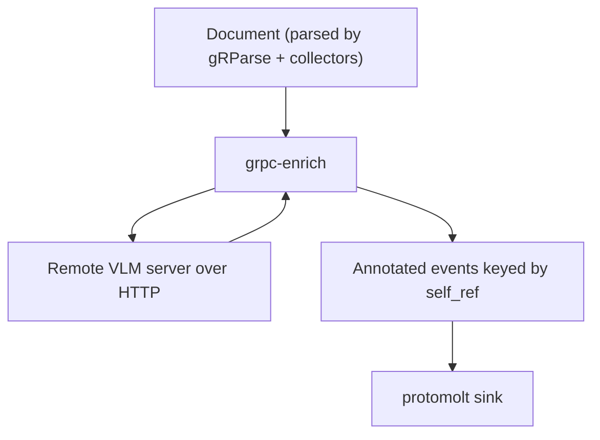

# grpc-enrich architecture

**Status:** implemented (v1 definition of done)
**Updated:** 2026-08-15

Implementers start at [`AGENTS.md`](../AGENTS.md), then this file, `design.md`, and `guidelines.md`.

## Where this sits

Running VLM enrichment inside the parse step makes parse slow and forces a
layout GPU to share a box with a multi-billion-parameter VLM. This service is
the second plane: a `Document` in, annotations out. Parse stays fast;
enrichment is opt-in and independently scaled.

This is not VLM-as-parser. Page-level VLM convert lives in
`grpc-vlm-convert`. Enrichment only writes on items that already exist
(`PictureItem`, code, formulas).

## Live results

The stream emits one annotation event per item as that VLM call returns. A UI
can show captions appearing on figures that already have boxes from parse,
while later pictures are still in flight. A failed crop is `ItemSkipped` on
the stream, not a held-back document. `EnrichComplete` is a trailer.

## What this process owns

Item selection. Pictures at or above 0.05 of the page area by default for
description (a negative threshold disables the check), pictures whose top
figure-class prediction is a supported chart type (`bar_chart` / `pie_chart`
/ `line_chart`) or whose label is `DOC_ITEM_LABEL_CHART` for chart
extraction, and code/formula text items.

VLM calls. The process calls a remote VLM (llama.cpp HTTP/gRPC, OVMS KServe
v2, or any OpenAI-compatible endpoint). Presets name the model families the
endpoint is expected to serve (SmolVLM, Granite Vision, Granite Vision
chart2csv, CodeFormula V2) with fixed prompts and generation budgets
(description 200, code/formula 2048, chart 4096 max tokens). The weights are
served elsewhere.

Output handling. Chart CSV becomes typed `TableData` (header row only when
the first row is all non-numeric; non-numeric data cells are `row_header`),
and code/formula output is stripped of sentinels with the leading
`<_language_>` token mapped to `CodeLanguageLabel` (UNKNOWN fallback).
Code/formula items are sent as image crops with the bare `<code>` /
`<formula>` prompt when a crop is available; text-only is the fallback.

Delivery. Annotations stream back keyed by `self_ref` so the caller can patch
a live document without buffering the whole result. Timeouts, concurrency
caps, and per-item failure do not fail the RPC (a bad crop skips; the rest
continue).

## What this process does not own

| Concern | Owner |
|---|---|
| Layout, OCR, table structure, figure class, barcodes | gRParse CV (already done) |
| Full-page VLM parse | `grpc-vlm-convert` |
| Loading Hugging Face transformers / torch | never, in this fleet |
| Chunking / embeddings | downstream |
| Export | protomolt |

## Language

**C++ or Java**, talking HTTP/gRPC to the model server. Prefer C++ if we
share crop/PNG encode with gRParse's picture pipeline; Java if we want this
next to protomolt's mapper. Either way: no PyTorch in the serving path.

Picture bytes come from `ImageRef` on the item (data URI or a claim-check the
caller already filled). This service does not rasterize PDFs.

## Relationship to gRParse

gRParse may call enrich after merge, or the client may call it separately.
Enrichment is never an implicit side effect of parse.
`ConvertDocumentOptions.do_picture_description` in the parse proto is a hint
the coordinator may forward, not work gRParse does itself.
